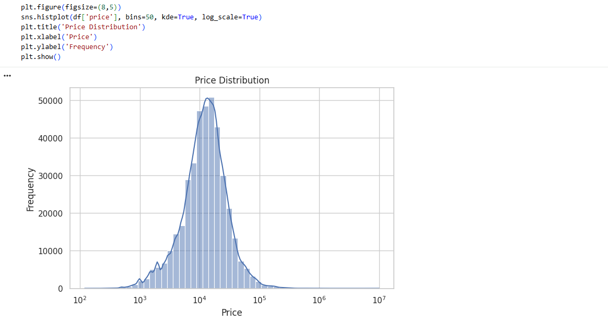
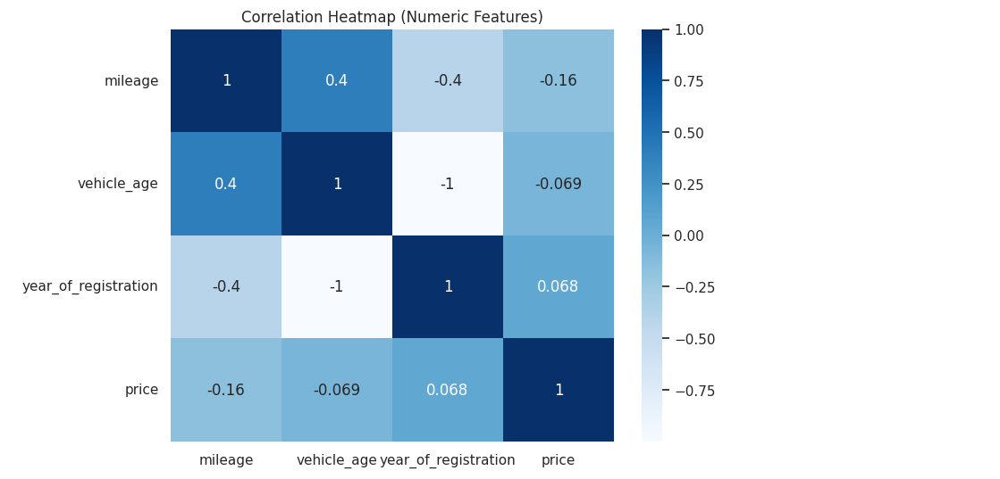
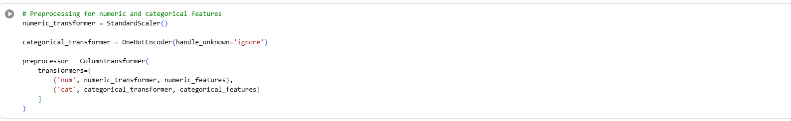
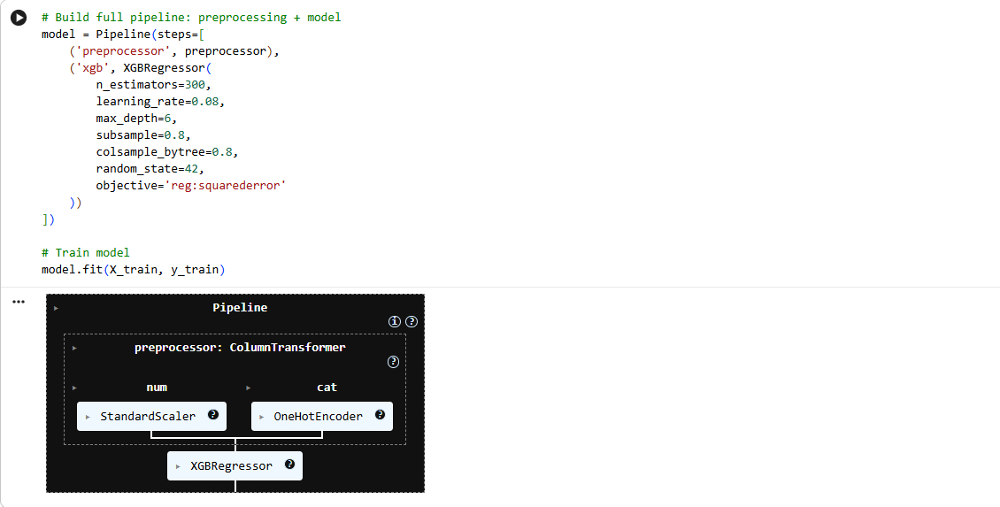

# CAR PRICE PREDICTION
Leveraging XGBoost for Data-Driven Valuation to Support Dealership and Marketplace Pricing Decisions

----

Disclaimer ⚠️: This project uses a public dataset of vehicle adverts and does not contain real proprietary, confidential, or sensitive information from any company, institution, or individual. It is designed to demonstrate capabilities of using Python to build a complete, professional supervised machine learning workflow.

## INTRODUCTION
This project predicts used car prices from real vehicle advert data. Accurate price prediction supports valuation tools, dealership pricing decisions, and online marketplaces, all of which depend on turning vehicle attributes into a defensible number. Using data on mileage, vehicle age, condition, body type, fuel type, and make/model popularity, this project builds a machine learning model that learns how these factors combine to determine price, and demonstrates a complete workflow covering cleaning, exploratory analysis, feature engineering, model training, and evaluation.

## PROBLEM STATEMENT
Used car prices vary widely and depend on complex, non-linear interactions between mileage, age, condition, and brand/model popularity.
Manual or intuition-based pricing is inconsistent and difficult to defend to buyers or sellers.
Real-world advert data is messy, with missing values in key fields such as registration year and mileage.
A need exists for a model that can learn realistic pricing relationships from historical adverts rather than fixed rules.
The project must justify the choice of a more complex model over a simple baseline using measurable evidence.

## AIM OF PROJECT
To build a machine learning model that accurately predicts used car prices from vehicle attributes.
To identify which features most strongly influence price, such as age, mileage, and make/model popularity.
To compare a simple baseline model against a stronger model and justify the added complexity with evidence.
To produce diagnostics that confirm the model generalises well rather than overfitting to noise.
To translate the model's findings into actionable guidance for dealerships and marketplaces.

## METHODOLOGY

### STEP 1: Data Cleaning
Handle missing values in mileage, registration year, and categorical fields.
Derive advert year and vehicle age from the advert identifier.
Remove identifier columns that carry no predictive value.
Correct anomalies such as negative or implausible vehicle ages.

### STEP 2: Exploratory Data Analysis (EDA)
Visualise distributions of price, mileage, and vehicle age.
Examine relationships between key features and price.
Check correlations among numeric variables.
Confirm that cleaned data behaves the way a used car market realistically should.

### STEP 3: Data Preprocessing
Scale numeric features and encode categorical features.
Engineer a combined make/model feature with frequency encoding.
Apply a log transformation to the price target to stabilise scale.

### STEP 4: Model Training
Train a Linear Regression baseline to establish a reference point.
Train an XGBoost regressor using a preprocessing pipeline.
Tune tree count, depth, learning rate, and subsampling to balance performance and generalisation.

### STEP 5: Model Evaluation (Interpreting Results)
Compare MAE and R² between the baseline and final model.
Visual Inspection: examine true-vs-predicted plots and residual distributions to evaluate whether the model captures real pricing patterns.
Extract feature importance to confirm the model aligns with domain expectations.

## LIBRARIES
Pandas: Used for loading, cleaning, and manipulating the advert data as structured DataFrames.
NumPy: Used for numerical operations, including the log transformation of price.
Matplotlib.pyplot: Used for static visualisations such as distributions and scatter plots.
Seaborn: Used to build clearer statistical graphics, including boxplots, heatmaps, and histograms.
Scikit-learn: Used for preprocessing (scaling, one-hot encoding), pipelines, the linear regression baseline, and evaluation metrics.
XGBoost: Used to train the final gradient-boosted regression model.

## EXPLORATORY DATA ANALYSIS (EDA)

### Numerical Data
During the exploratory analysis of the numerical variables, price was found to be heavily right-skewed, with most vehicles in a moderate price range and a smaller number of high-value listings pulling the distribution's tail out. This confirmed that a log transformation of price was appropriate ahead of modelling.

Mileage and vehicle age both showed strong negative relationships with price, consistent with expectations that higher-mileage and older vehicles are worth less.

Correlation analysis across the numeric features reinforced these patterns, with mileage and vehicle age both showing meaningful negative correlation with price, confirming that these variables would carry real predictive weight in modelling.

Data also revealed noticeable price variation across body types, suggesting that vehicle segment carries independent pricing signal beyond mileage and age alone.

### Data Preprocessing
After engineering a combined make/model feature and applying frequency encoding, the dataset was organised into a compact set of numeric predictors (mileage, vehicle age, year of registration, make/model frequency) and categorical predictors (body type, fuel type, vehicle condition), which were then scaled and one-hot encoded respectively within a single preprocessing pipeline.

### Model Training
Modelling was performed first with a Linear Regression baseline, then with an XGBoost regressor (300 trees, max depth 6, learning rate 0.08, with row and column subsampling), trained on an 80/20 split of the data.

### Visualisation
The true-vs-predicted plot for the XGBoost model shows predictions clustering closely around the diagonal, indicating that predicted log prices track actual log prices closely across the price range.

[image: true vs. predicted price scatter plot]

The residuals distribution is centred around zero without heavy skew, indicating that the model's errors are evenly distributed rather than systematically biased toward over- or under-pricing any segment.

[image: residuals distribution plot]

Feature importance analysis shows the model relying most heavily on vehicle age, mileage, and the frequency-encoded make/model feature, with fuel type and body type contributing secondary but meaningful signal.

[image: top 15 feature importance bar chart]

## KEY INSIGHTS
Price is heavily right-skewed, which supported the decision to model on a log-transformed target.
Mileage and vehicle age both show strong negative relationships with price, consistent with real-world market behaviour.
Linear Regression, used as a baseline, achieved an MAE of 0.385 and an R² of 0.622 on log price.
XGBoost, the final model, achieved an MAE of 0.183 and an R² of 0.898 on log price, roughly halving the baseline's error and explaining substantially more variance.
The performance gap between the two models confirms that car pricing depends on non-linear interactions that a linear model cannot capture.
Feature importance results show vehicle age, mileage, and make/model popularity as the dominant predictors, matching real-world automotive pricing intuition.
Body type and fuel type contribute secondary but meaningful signal, reflecting how different vehicle segments occupy different price bands.
The alignment between model behaviour and domain expectations increases confidence that the model has learned genuine pricing structure rather than noise.

## RECOMMENDATION
Adopt the XGBoost model as the pricing reference point for dealership and marketplace valuation tools, given its clear performance advantage over a linear baseline.
Use the model's predictions to flag listings priced well above or below the model's estimate, supporting mis-pricing detection and improved buyer/seller trust.
Prioritise vehicle age and mileage in any simplified or manual pricing guidance, as these carry the strongest influence on price.
Incorporate make/model popularity into pricing strategy, since certain brands and models consistently command stronger resale value.
Extend the model with location data to capture regional price variation, which is not currently represented.
Add time-based features to account for seasonal demand shifts in the used car market.
Periodically retrain the model on recent listings to ensure pricing guidance stays aligned with a shifting market.

